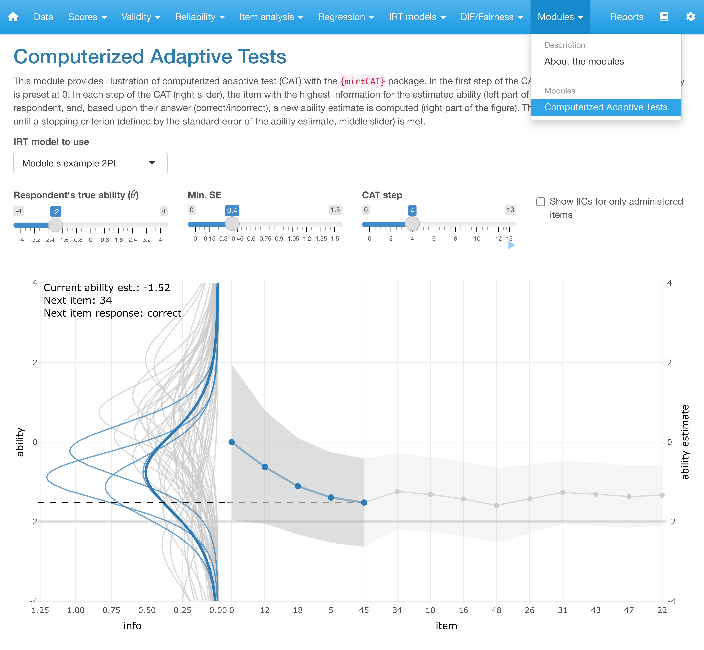

<!-- README.md is generated from README.Rmd. Please edit that file -->

# SIAmodules

<!-- badges: start -->

[](https://CRAN.R-project.org/package=SIAmodules)
[](https://lifecycle.r-lib.org/articles/stages.html#experimental)

<!-- badges: end -->

## Overview

`SIAmodules` is a curated collection of extension modules for the
`ShinyItemAnalysis` package which includes functions and interactive
shiny application for the psychometric analysis of educational tests,
psychological assessments, health-related and other types of multi-item
measurements, or ratings from multiple raters. `SIAmodules` offer
additional interactive presentations of selected psychometric topics:

- Computerized Adaptive Tests
- Differential Item Functioning in Change (DIF-C)
- Range-restricted Reliability

<div class="figure" style="text-align: center; margin-top: 40px;">



<p class="caption">

“Computerized Adaptive Tests” module in the ShinyItemAnalysis app

</p>

</div>

All modules are installed online at [Czech Academy of Sciences
server](https://shiny.cs.cas.cz/ShinyItemAnalysis/). Visit our [**web
page**](http://www.shinyitemanalysis.org/) about `ShinyItemAnalysis` to
learn more!

## Usage

First, install the package from CRAN with:

``` r
install.packages("SIAmodules")
```

Then, to use the aforementioned modules, run `ShinyItemAnalysis`
interactive application in `R`.

``` r
ShinyItemAnalysis::run_app()
```

You’ll then find them located in the individual sections.

Or try it directly online at [Czech Academy of Sciences
server](https://shiny.cs.cas.cz/ShinyItemAnalysis/)!

## References

When using `SIAmodules` and the `ShinyItemAnalysis` software, we
appreciate if you include a reference in your publications. To cite the
software, please, use:

> Martinková P., & Hladká A. (2023) Computational Aspects of
> Psychometric Methods: With R. Chapman and Hall/CRC. [doi:
> 10.1201/9781003054313](https://doi.org/10.1201/9781003054313).

and/or:

> Martinková P., & Drabinová A. (2018) ShinyItemAnalysis for teaching
> psychometrics and to enforce routine analysis of educational tests.
> The R Journal, 10(2), 503-515. [doi:
> 10.32614/RJ-2018-074](https://doi.org/10.32614/RJ-2018-074).

## Getting help and provide feedback

If you find any bug or just need help with `SIAmodules` or the
`ShinyItemAnalysis` you can directly contact us at
<martinkova@cs.cas.cz>.

## License

This program is free software and you can redistribute it and or modify
it under the terms of the [GNU GPL
3](https://www.gnu.org/licenses/gpl-3.0.en.html).
